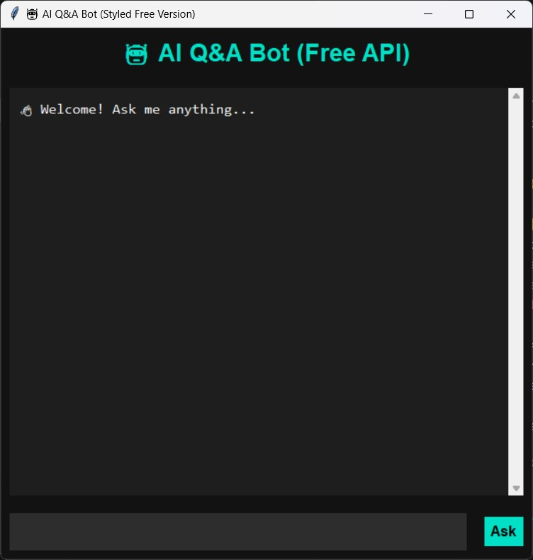
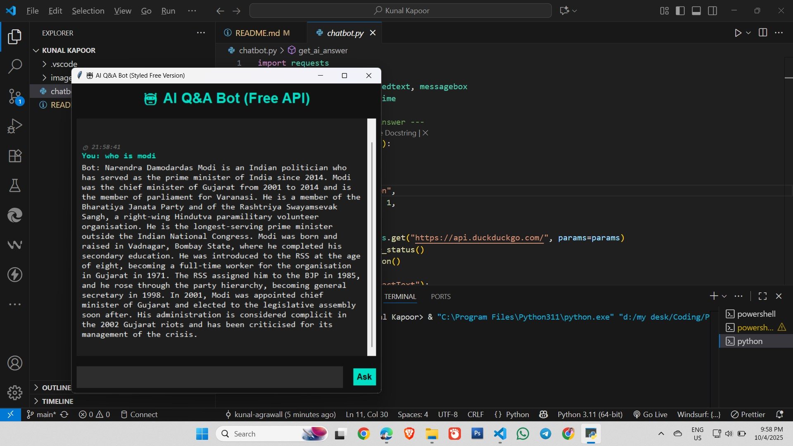

# 🤖 AI Q&A Bot (Free Version)

A simple **desktop chatbot application** built with **Python** and **Tkinter**, which answers user questions using the **DuckDuckGo Instant Answer API**. It provides a clean, interactive chat interface where users can type questions and receive AI-generated answers.

---

## **Features**
- Interactive chat interface using **Tkinter** with a styled theme.
- Retrieves answers from **DuckDuckGo API**:
  - Returns `AbstractText` if available.
  - Falls back to `Answer` or related topics.
  - Handles errors gracefully.
- Timestamped conversation logs displayed in the chat window.
- "Thinking..." indicator while fetching answers.
- Responsive UI with scrollable chat area.
- Lightweight and easy to run on any system with Python 3.x.

---

## **Screenshots**




---

## **Installation**
1. Clone the repository:
   ```bash
   git clone https://github.com/Kunal-agrawall/python_assignment.git
